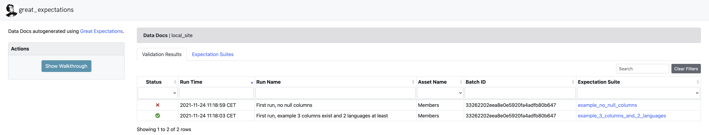
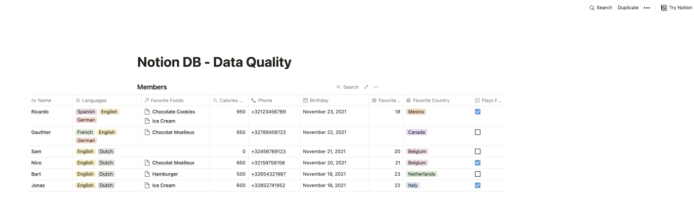
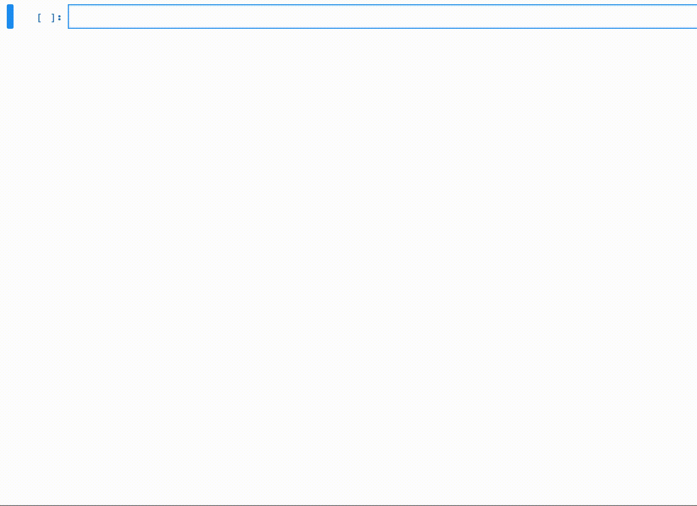
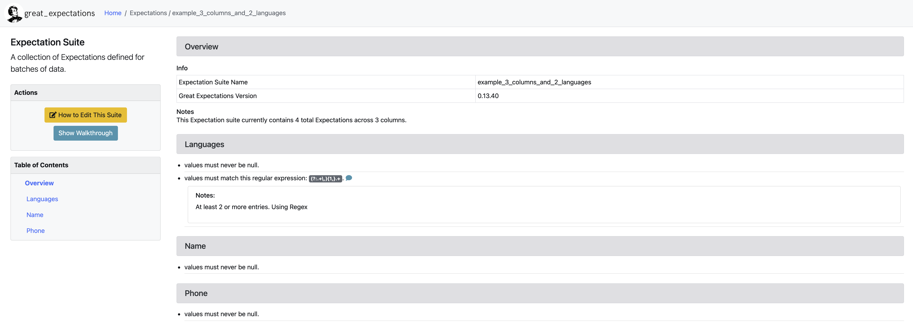
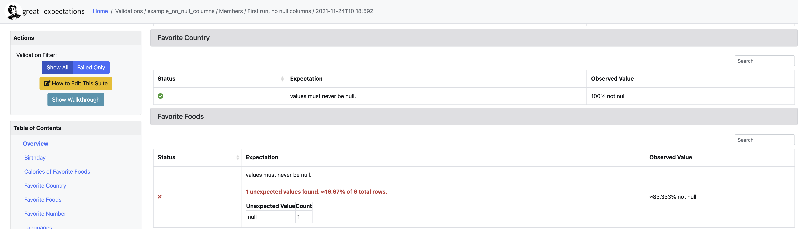
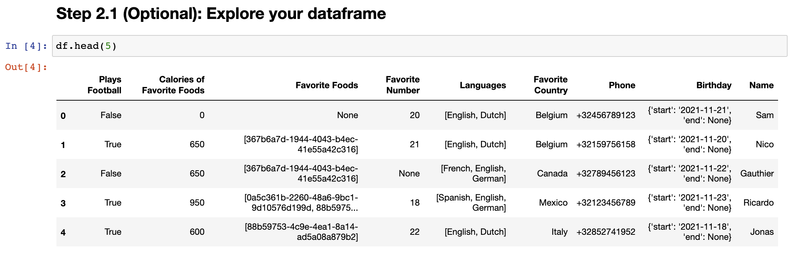

    

# Data Quality for Notion Databases 🚀
Using [Notion's API](https://developers.notion.com/) + [Great Expectations](https://greatexpectations.io/), you'll be able to easily set up expectations for your Notion's database, while taking advantage of their web-based Data Docs to explore your results

## 👶 ELI5: *'expectations'*
Expectations, as the name implies are qualities you expect from your data. The most common are column-scoped, but there are also row and table-scoped.

Expectations can be as simple as ["I want to be sure that this column is never null"](https://greatexpectations.io/expectations/expect_column_values_to_not_be_null) or ["I want to make sure the row count is always X".](https://greatexpectations.io/expectations/expect_table_row_count_to_equal) If you want to dig deeper or find a list of possible expectations, you can do so at [Great Expectation's official site](https://greatexpectations.io/expectations)

🚨Be aware that if you don't find an expectation you need, you can always make it yourself. Find the tutorial for that [here](https://docs.greatexpectations.io/docs/guides/expectations/creating_custom_expectations/how_to_create_custom_expectations/).

# What's in here? 📑
This repo contains the following:
- Minimal, lightweight Notion API focused on databases
- Minimal setup for a Great Expectations project
- Scripts to connect your databases to expectation suites, check your Notion API token, etc...

# Installing dependencies

Requirements:

- Python ≥3.9
- Poetry ([official instructions](https://python-poetry.org/docs/)).
  - For linux, run:  `curl -sSL https://raw.githubusercontent.com/python-poetry/poetry/master/get-poetry.py | python -`

1. Clone the repo
2. Run `poetry install`

# Example / Demo
We've made available a public database so you can go through the whole process without having to have a database yourself.

### Step 1: Open and copy our public database [here](https://dataroots.notion.site/Notion-DB-Data-Quality-2753e01d5f694e43b9455c74743395ae)
It should look something like the image below. Be aware this may change in the future.

Now you can duplicate it into your workspace by clicking on "Duplicate" on the top-right corner.

Once you've successfully duplicated it, the databse is yours. You are free to edit it or keep it for the rest of the demo.

# Step 2: Authentication 🔐
**First things first**: before you can do anything, you need to have a token to authenticate to Notion's API. Notion does this via 'Integrations'.

## Authenticating (creating a Notion integration) 🤫

For the most up to date, follow the official guide for authentication [here](https://developers.notion.com/docs/authorization). Choose "internal integration".

Go to [https://www.notion.so/my-integrations](https://www.notion.so/my-integrations) and create your internal integration.

Once you have your integration's token (it starts with '**secret_**'), be sure that it is accessible as the environment variable `NOTION_API_KEY` as both the notebook and scripts will look for it there.

To do so, in linux do `export NOTION_API_KEY=secret_XXXXX`.

To check that your token is valid and the script can access it, you can run:  `poetry run python ./src/check_connection.py`

## Allowing your integration to access your db 🔓

Creating the integration is not enough. The integration must have access to each of the databases (this also applies to databases to which one of your original databases 'relate to'.

To give access to a page or db to your integration. Open the page/db and on the top right click "Share". Then look for the name of your integration as if it were an user.

# Step 3: Your first Expectation Suite

**🚨There are a pair of expectation suite examples included. Feel free to skip to step #4 if you just want to run the demo ASAP 🚨**

An *expectation suite* is Great Expectations' way of calling a group of expectations.

## Creating an expectation suite
Included is a jupyter notebook to interactively create your expectations. This is useful as it lets you see how your data looks like and if your expectations will run or not with your current data.

run `poetry run jupyter notebook --script src/build_expectations.ipynb` and follow the instructions inside the notebook.

### Step 3.1 Getting your db's url
For this and further steps you'll need your db's url. This is not the page itself where the db lives, but the db is a page of itself.

Simply click on the "..." on the db and choose "open as page". Then copy (including the https) url.

Inside the jupyter notebook, you'll be able to interactively create expectations while seeing results, like so:

⚠️ **Be sure to run the last cell to save your expectations!** ⚠️

## Where are my expectations? 🕵
So you've created your expectation suite and saved it using the jupyter notebook we talked about above. Now you want to see where are your expectations saved, right?

### Option 1: In Data Docs (Web)
Another great way of seeing your available expectation suites is through the Data Docs, which are explained below. In short, run `poetry run great_expectations docs build`, answer yes and the your Data Docs website should open automatically.

### Option 2: In terminal
If you only want to see a list of your created expectation suites in the terminal, run:  `poetry run great_expectations suite list`

### Option 3: JSON files
You can find all your expectation suites as .json files under [./great_expectations/expectations/](./great_expectations/expectations/)

# Step 4: Running your expectations ✅

Now you have your expectations and you want to start running some validations, right? Or maybe you skipped step #3 and will use the provided examples, that's ok, too.

The script [./src/validate.py](./src/validate.py) is there to help you run your validations by running an Expectation Suite against a Notion DB.      
Run `poetry run python src/validate.py -h` to see an explanation of each argument.

In the simplest case, you'll need the following 3 arguments:

- **run_name** (string in between quotes)
  - Example: "Running provided example_3_columns_and_2_languages"
- **expectation_suite** (string, expectation suite)
  - Example: example_3_columns
- **db** (string, https link of the database in any view)
  - Example: https://www.notion.so/7510946dd2d64d94925c4389291f71c7?v=8fa5e1afced34272b250f69699a21df9
  - 🚨 This url varies by workspace so it will be different for you. Refer to step 3.1 above to learn how to get yours.

To run this example: `poetry run python src/validate.py --run_name "Running provided example_3_columns_and_2_languages" --expectation_suite example_3_columns --db https://www.notion.so/7510946dd2d64d94925c4389291f71c7?v=8fa5e1afced34272b250f69699a21df9`

# Data Docs (seeing your results, expectation suites and history) 📊
One of the great things from Great Expectations is their Data Docs. Data Docs are these HTML pages that Great Expectations compile from your expectation suites and validation runs. To learn more, here is the original [website](https://docs.greatexpectations.io/docs/reference/data_docs/).

Here you can see a log of all your previous runs with information on a per-expectation level.

To see your Data Docs, run: `poetry run great_expectations docs build`. This will prompt a yes/no question, answer 'y' and the website should automatically open in a web browser.
## Result Example
In Data Docs you can see the results of all your expectations.
In the image below, you can see a subset of the results, for column 'Favorite Country' and 'Favorite Foods'
- ✅ there are no empty entries on the column 'Favorite Country'
- ❌ there is 1 empty/null entry on the column 'Favorite Foods'

# Known problems / Future features

- **Problem**: When running validation.py with a validation suite that contains validations of type *expect_column_values_to_match_regex*, GE will complain and throw an error about the profiler not being able to render something. Nevertheless, everything works as expected.

- **Future nice-to-have**: Columns of type "relate_to", now return the page id of the entry (see column 'Favorite Foods', not the name of the entry itself. This is perfectly ok to run expectations that check a minimum number of entries (e.g. expect_column_values_to_match_regex), but for further string parsing, the name could be more useful.

- **Future nice-to-have:** the Data Docs parser should be able to be edited to show more information (e.g. which row made the expectation fail)

## Questions/improvements? 🙋
Feel free to open up a PR or drop me a message @ ricardo@dataroots.io

## Curious about other projects? 🤔
For more cool stuff regarding anything data, check us out:      
[Website](https://dataroots.io/)

[Github](https://github.com/datarootsio)